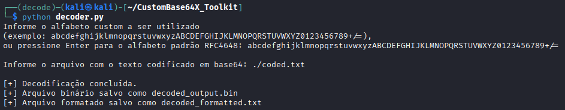

# CustomBase64X Toolkit

## Descrição

Ferramenta para decodificação de documentos codificados em Base64, com suporte a alfabetos customizados e preparação para aplicação de XOR. A ferramenta processa arquivos contendo strings Base64, realiza a decodificação e gera saídas em formato binário e texto formatado.

## Funcionalidades

- **Suporte a alfabetos customizados**: Permite especificar um alfabeto Base64 diferente do padrão RFC4648;
- **Decodificação robusta**: Inclui filtros para validação e limpeza de dados;
- **Padding automático**: Ajusta automaticamente strings Base64 incompletas;
- **Múltiplas saídas**: Gera arquivos binários e texto formatado;
- **Tratamento de erros**: Ignora tokens inválidos e caracteres não-UTF8;

## Requisitos

- `Python 3.x`
- Nenhuma dependência externa necessária

## Instalação

Clone o repositório ou baixe o arquivo Python:
```bash
git clone https://github.com/pcanossa/CustomBase64X_Toolkit.git
cd CustomBase64X_Toolkit
```

## Uso

Execute o script Python:
```bash
python decoder.py
```

### Passo a passo

1. **Definir alfabeto**: Quando solicitado, informe o alfabeto customizado ou pressione Enter para usar o padrão RFC4648
   
   Exemplo de alfabeto customizado:
```
   abcdefghijklmnopqrstuvwxyzABCDEFGHIJKLMNOPQRSTUVWXYZ0123456789+/=
```

2. **Informar arquivo de entrada**: Digite o caminho do arquivo contendo o texto codificado em Base64

3. **Aguardar processamento**: A ferramenta irá processar o arquivo e gerar as saídas

### Exemplo de execução
```Bash
Informe o alfabeto custom a ser utilizado
(exemplo: abcdefghijklmnopqrstuvwxyzABCDEFGHIJKLMNOPQRSTUVWXYZ0123456789+/=),
ou pressione Enter para o alfabeto padrão RFC4648: abcdefghijklmnopqrstuvwxyzABCDEFGHIJKLMNOPQRSTUVWXYZ0123456789+/=

Informe o arquivo com o texto codificado em base64: ./coded.txt

[+] Decodificação concluída.
[+] Arquivo binário salvo como decoded_output.bin
[+] Arquivo formatado salvo como decoded_formatted.txt
```
</br>



## Formato do arquivo de entrada

O arquivo de entrada deve conter strings Base64, podendo estar em formatos como:

- Linhas simples com tokens Base64
- Arrays JavaScript/JSON (a ferramenta remove automaticamente `"`, `,`, `[`, `]`)
- Um token por linha ou múltiplos tokens

**Exemplo de entrada válida:**
```
SGVsbG8gV29ybGQ=
WW91ciBkYXRhIGhlcmU=
["dGVzdA==", "ZGF0YQ=="]
```

## Arquivos de saída

A ferramenta gera dois arquivos:

1. **decoded_output.bin**: Arquivo binário com os bytes decodificados
2. **decoded_formatted.txt**: Arquivo de texto com uma palavra por linha

## Filtros aplicados

A ferramenta aplica os seguintes filtros durante o processamento:

- **Tamanho mínimo**: Tokens com menos de 6 caracteres são ignorados
- **Validação de alfabeto**: Apenas caracteres presentes no alfabeto definido são aceitos
- **Limpeza estrutural**: Remove caracteres comuns de arrays JS/JSON (`, " [ ]`)
- **Encoding UTF-8**: Caracteres inválidos são ignorados na conversão

## Casos de uso

Esta ferramenta é útil para:

- Análise forense de dados codificados
- Decodificação de payloads ofuscados
- Processamento de dados com alfabetos Base64 não-padrão
- Preparação de dados para operações XOR subsequentes
- Extração de informações de arquivos `JavaScript`/``JSON` codificados

## Limitações

- Arquivos muito grandes podem consumir memória significativa
- A decodificação UTF-8 ignora caracteres inválidos (modo `errors="ignore"`)
- Tokens com caracteres fora do alfabeto são descartados completamente

## Contribuindo

Contribuições são bem-vindas! Sinta-se à vontade para:

- Reportar bugs
- Sugerir novas funcionalidades
- Enviar pull requests

## Autor

Patrícia Canossa

## Notas de segurança

Esta ferramenta foi desenvolvida para fins educacionais e de análise de segurança. Use-a de forma responsável e apenas em dados que você tem permissão para analisar.